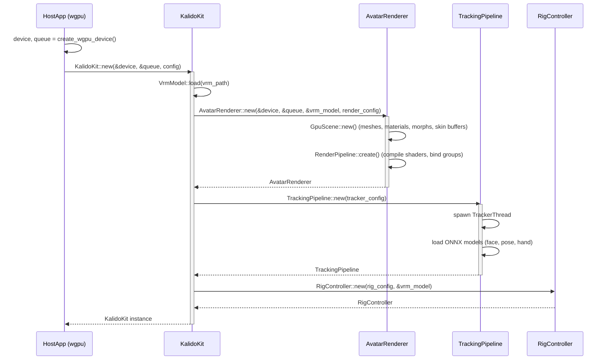
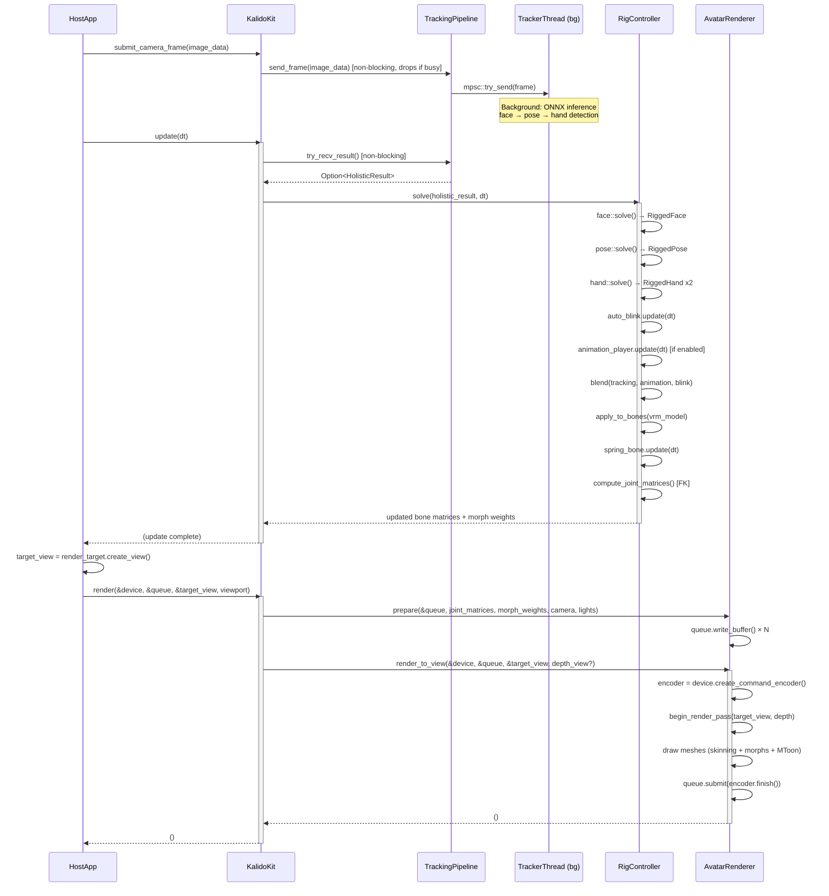
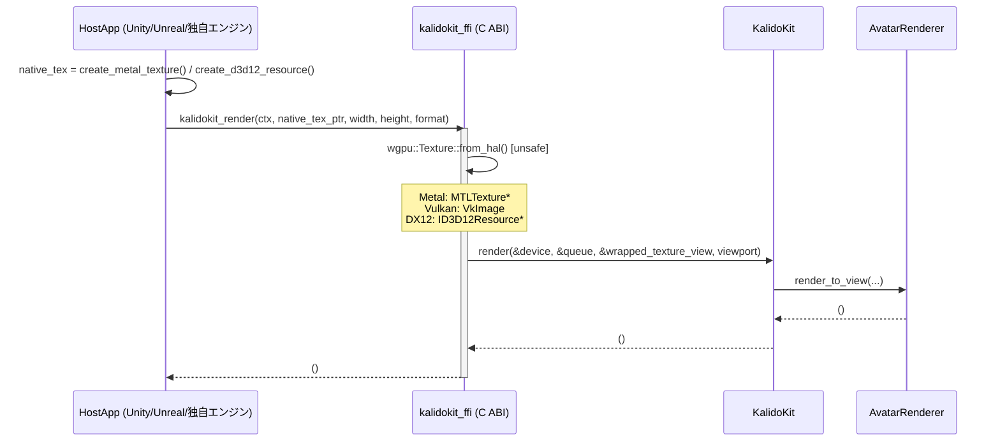

# kalidokit-core クレート設計書

## 1. 概要

`kalidokit-core` は、外部の wgpu アプリケーションから GPU テクスチャ（`wgpu::Texture` または native texture pointer）を受け取り、VRM アバターのモーションキャプチャ・レンダリングを行うライブラリクレートである。

**ホストアプリケーションが所有するもの**: `wgpu::Device`, `wgpu::Queue`, `wgpu::Texture`（レンダーターゲット）
**本クレートが所有するもの**: VRM モデル、トラッキングパイプライン、ソルバー、レンダーパイプライン、内部 GPU リソース

### 1.1 設計原則

| 原則 | 説明 |
|------|------|
| **Zero-ownership of GPU context** | Device/Queue/Surface を所有しない。ホストから借用する |
| **Texture-in, Texture-out** | 入力: カメラフレーム (CPU image or GPU texture)。出力: ホスト指定の `wgpu::TextureView` へのレンダリング |
| **Non-blocking tracking** | ML 推論はバックグラウンドスレッドで実行。レンダースレッドをブロックしない |
| **Deterministic pipeline** | 同一入力に対して同一出力を保証（PRNG seed 指定可能） |
| **No windowing dependency** | winit, nokhwa 等のウィンドウ/カメラクレートに依存しない |

---

## 2. E-R 図（Entity-Relationship Diagram）

```mermaid
erDiagram
    KalidoKit ||--|| AvatarRenderer : owns
    KalidoKit ||--|| TrackingPipeline : owns
    KalidoKit ||--|| RigController : owns
    KalidoKit ||--o| AnimationPlayer : "optional, owns"

    AvatarRenderer ||--|| GpuScene : owns
    AvatarRenderer ||--|| RenderPipeline : owns
    AvatarRenderer }o--|| ExternalTexture : "renders to (borrowed)"
    AvatarRenderer }o--|| DeviceQueue : "uses (borrowed)"

    GpuScene ||--|{ GpuMesh : contains
    GpuScene ||--|{ GpuMaterial : contains
    GpuScene ||--|| SkinData : contains
    GpuScene ||--|{ PerMeshMorph : contains
    GpuScene ||--|| DepthTexture : owns
    GpuScene ||--|| CameraState : contains
    GpuScene ||--|| LightingState : contains

    TrackingPipeline ||--|| TrackerThread : owns
    TrackerThread ||--|| HolisticTracker : "runs on bg thread"
    HolisticTracker ||--|| FaceMeshDetector : owns
    HolisticTracker ||--|| PoseDetector : owns
    HolisticTracker ||--|{ HandDetector : owns

    RigController ||--|| FaceSolver : uses
    RigController ||--|| PoseSolver : uses
    RigController ||--|| HandSolver : uses
    RigController ||--|| RigConfig : owns
    RigController ||--|| AutoBlink : owns
    RigController ||--|| RigState : owns

    VrmAsset ||--|| VrmModel : "loaded from"
    VrmModel ||--|{ MeshData : contains
    VrmModel ||--|{ Material : contains
    VrmModel ||--|| HumanoidBones : contains
    VrmModel ||--|{ BlendShapeGroup : contains
    VrmModel ||--o| SpringBoneSystem : "optional"
    VrmModel ||--o| LookAtApplyer : "optional"

    AnimationPlayer ||--|| AnimationClip : plays
    AnimationClip ||--|{ AnimationChannel : contains

    DeviceQueue {
        wgpu-Device device
        wgpu-Queue queue
    }

    ExternalTexture {
        wgpu-TextureView view
        u32 width
        u32 height
        TextureFormat format
    }

    KalidoKit {
        KalidoKitConfig config
    }
```



---

## 3. シーケンス図

### 3.1 初期化シーケンス



### 3.2 毎フレーム更新シーケンス



### 3.3 Native Texture Pointer 受け渡しシーケンス



---

## 4. モジュール構成図

```
kalidokit-core (lib crate)
├── lib.rs                      # Public API: KalidoKit struct + re-exports
│
├── config.rs                   # KalidoKitConfig, RenderConfig, TrackerConfig, RigConfig
│
├── avatar_renderer/            # GPU レンダリング層
│   ├── mod.rs                  # AvatarRenderer public API
│   ├── scene.rs                # GpuScene: mesh/material/buffer 管理
│   ├── pipeline.rs             # wgpu RenderPipeline 生成 (MToon shader)
│   ├── skin.rs                 # SkinData: LBS joint matrices SSBO
│   ├── morph.rs                # PerMeshMorph: morph target weights/deltas
│   ├── mesh.rs                 # GpuMesh: vertex/index buffer
│   ├── material.rs             # GpuMaterial: MToon uniform + texture bind group
│   ├── camera.rs               # CameraState: view-projection uniform
│   ├── depth.rs                # DepthTexture 管理
│   ├── texture.rs              # GpuTexture: image → wgpu texture upload
│   ├── light.rs                # StageLighting, LightPreset, ShadingMode
│   └── vertex.rs               # Vertex layout (position, normal, uv, joints, weights)
│
├── tracking/                   # ML 推論層
│   ├── mod.rs                  # TrackingPipeline public API
│   ├── tracker_thread.rs       # バックグラウンド推論スレッド (mpsc channels)
│   ├── holistic.rs             # HolisticTracker: face+pose+hand orchestration
│   ├── face_mesh.rs            # FaceMeshDetector: 468 points, ONNX
│   ├── pose.rs                 # PoseDetector: 33 points, ONNX
│   ├── hand.rs                 # HandDetector: 21 points, ONNX
│   └── preprocess.rs           # Image resize/normalize for ONNX input
│
├── rig/                        # モーション解決層
│   ├── mod.rs                  # RigController public API
│   ├── face_solver.rs          # Face landmarks → head/eye/mouth rig
│   ├── pose_solver.rs          # Pose landmarks → hip/spine/limb rig
│   ├── hand_solver.rs          # Hand landmarks → finger rig
│   ├── auto_blink.rs           # 自動まばたき (xorshift32 PRNG)
│   ├── rig_config.rs           # BoneConfig (dampener, lerp per bone)
│   └── state.rs                # RigState: current face/pose/hand results
│
├── vrm/                        # VRM モデル管理層 (既存 vrm crate 内包)
│   ├── mod.rs                  # VrmModel public API
│   ├── loader.rs               # GLB/VRM パーサー (gltf crate)
│   ├── bone.rs                 # HumanoidBones, FK, joint matrix 計算
│   ├── blendshape.rs           # BlendShapeGroup, morph weight 管理
│   ├── animation.rs            # AnimationClip ローダー (FBX/GLB)
│   ├── animation_player.rs     # AnimationPlayer, BlendConfig
│   ├── spring_bone.rs          # SpringBone 物理シミュレーション
│   └── look_at.rs              # LookAtApplyer: 視線制御
│
├── types.rs                    # 共有型定義 (HolisticResult, RiggedFace, etc.)
│
└── ffi/                        # C ABI バインディング (feature-gated)
    ├── mod.rs                  # #[no_mangle] extern "C" 関数群
    └── native_texture.rs       # Native texture ptr → wgpu::Texture 変換
```

---

## 5. ディレクトリ構成

```
crates/kalidokit-core/
├── Cargo.toml
├── src/
│   ├── lib.rs
│   ├── config.rs
│   ├── types.rs
│   │
│   ├── avatar_renderer/
│   │   ├── mod.rs
│   │   ├── scene.rs
│   │   ├── pipeline.rs
│   │   ├── skin.rs
│   │   ├── morph.rs
│   │   ├── mesh.rs
│   │   ├── material.rs
│   │   ├── camera.rs
│   │   ├── depth.rs
│   │   ├── texture.rs
│   │   ├── light.rs
│   │   └── vertex.rs
│   │
│   ├── tracking/
│   │   ├── mod.rs
│   │   ├── tracker_thread.rs
│   │   ├── holistic.rs
│   │   ├── face_mesh.rs
│   │   ├── pose.rs
│   │   ├── hand.rs
│   │   └── preprocess.rs
│   │
│   ├── rig/
│   │   ├── mod.rs
│   │   ├── face_solver.rs
│   │   ├── pose_solver.rs
│   │   ├── hand_solver.rs
│   │   ├── auto_blink.rs
│   │   ├── rig_config.rs
│   │   └── state.rs
│   │
│   ├── vrm/
│   │   ├── mod.rs
│   │   ├── loader.rs
│   │   ├── bone.rs
│   │   ├── blendshape.rs
│   │   ├── animation.rs
│   │   ├── animation_player.rs
│   │   ├── spring_bone.rs
│   │   └── look_at.rs
│   │
│   └── ffi/
│       ├── mod.rs
│       └── native_texture.rs
│
├── shaders/
│   ├── skinning.wgsl           # MToon + LBS + morph targets
│   └── depth_only.wgsl         # depth pre-pass (optional)
│
└── tests/
    ├── integration/
    │   ├── init_test.rs         # KalidoKit::new() + offscreen render
    │   ├── render_test.rs       # render_to_texture 検証
    │   └── rig_test.rs          # solver → bone matrix 検証
    └── unit/
        ├── config_test.rs
        └── types_test.rs
```

---

## 6. Public API 詳細設計

### 6.1 `KalidoKit` — メインエントリーポイント

```rust
/// kalidokit-core のメインインスタンス。
/// ホストアプリケーションは device/queue を所有し、本構造体に貸与する。
pub struct KalidoKit {
    vrm_model: VrmModel,
    renderer: AvatarRenderer,
    tracking: TrackingPipeline,
    rig: RigController,
    animation: Option<AnimationPlayer>,
}

impl KalidoKit {
    /// 新規インスタンスを生成する。
    ///
    /// # Arguments
    /// * `device` - ホストの wgpu::Device (borrowed, 呼び出し側が生存期間を保証)
    /// * `queue` - ホストの wgpu::Queue
    /// * `config` - 初期化設定
    ///
    /// # Errors
    /// VRM ファイルが見つからない / ONNX モデルの読み込み失敗 / GPU リソース生成失敗
    pub fn new(
        device: &wgpu::Device,
        queue: &wgpu::Queue,
        config: KalidoKitConfig,
    ) -> Result<Self>;

    /// カメラフレームを送信する（非ブロッキング）。
    /// トラッカースレッドがビジーの場合はフレームをドロップする。
    ///
    /// # Arguments
    /// * `image` - RGBA8 画像データ (CPU メモリ)
    /// * `width` - 画像幅 (px)
    /// * `height` - 画像高さ (px)
    pub fn submit_camera_frame(&self, image: &[u8], width: u32, height: u32);

    /// フレーム更新（トラッキング結果取得 → ソルバー → リグ適用 → 物理）。
    /// レンダリング前に毎フレーム呼ぶ。
    ///
    /// # Arguments
    /// * `dt` - 前フレームからの経過時間 (秒)
    pub fn update(&mut self, dt: f32);

    /// 指定の TextureView にアバターをレンダリングする。
    ///
    /// # Arguments
    /// * `device` - wgpu::Device
    /// * `queue` - wgpu::Queue
    /// * `target` - レンダー先テクスチャビュー (ホスト所有)
    /// * `depth` - depth テクスチャビュー (None の場合は内部で管理)
    /// * `viewport` - レンダリング領域
    ///
    /// ホストの render pass に組み込む場合は `render_to_pass()` を使用する。
    pub fn render(
        &mut self,
        device: &wgpu::Device,
        queue: &wgpu::Queue,
        target: &RenderTarget,
    );

    /// ホストの既存 RenderPass にアバター描画コマンドを記録する。
    /// ホストが自前の render pass を持つ場合に使用。
    pub fn render_to_pass<'a>(
        &'a self,
        render_pass: &mut wgpu::RenderPass<'a>,
    );

    /// レンダリング解像度変更時に呼ぶ。
    /// 内部 depth buffer 等を再生成する。
    pub fn resize(&mut self, device: &wgpu::Device, width: u32, height: u32);

    /// VRM モデルを動的に差し替える。
    pub fn load_vrm(
        &mut self,
        device: &wgpu::Device,
        queue: &wgpu::Queue,
        vrm_path: &std::path::Path,
    ) -> Result<()>;

    /// アイドルアニメーションを設定する。
    pub fn set_animation(
        &mut self,
        clip: AnimationClip,
        blend_config: BlendConfig,
    );

    /// ライティングを変更する。
    pub fn set_lighting(&mut self, lighting: StageLighting);

    /// カメラ位置/角度を変更する。
    pub fn set_camera(&mut self, camera: CameraParams);

    /// まばたきモードを切り替える。
    pub fn set_blink_mode(&mut self, mode: BlinkMode);

    /// トラッキングの有効/無効を切り替える。
    pub fn set_tracking_enabled(&mut self, enabled: bool);

    /// 現在の RigState (顔/体/手のソルバー結果) を取得する。
    /// ホスト側で独自の処理を行う場合に使用。
    pub fn rig_state(&self) -> &RigState;

    /// 現在のボーン行列を取得する（外部レンダラー向け）。
    /// ホスト側が独自のスキニングシェーダーを使う場合。
    pub fn joint_matrices(&self) -> &[glam::Mat4];

    /// 現在のモーフウェイトを取得する。
    pub fn morph_weights(&self, mesh_index: usize) -> &[f32];

    /// リソースを解放する。TrackerThread の join を待つ。
    pub fn destroy(self);
}
```

### 6.2 `RenderTarget` — レンダリング先指定

```rust
/// ホストアプリケーションが指定するレンダリングターゲット。
pub struct RenderTarget<'a> {
    /// レンダリング先テクスチャビュー
    pub color_view: &'a wgpu::TextureView,
    /// depth テクスチャビュー (None の場合は内部管理)
    pub depth_view: Option<&'a wgpu::TextureView>,
    /// レンダリング領域 (None の場合はテクスチャ全体)
    pub viewport: Option<Viewport>,
    /// テクスチャフォーマット (ホスト側のフォーマットに合わせる)
    pub format: wgpu::TextureFormat,
    /// テクスチャサイズ
    pub width: u32,
    pub height: u32,
}

/// レンダリング領域（ピクセル単位）。
pub struct Viewport {
    pub x: f32,
    pub y: f32,
    pub width: f32,
    pub height: f32,
    pub min_depth: f32,
    pub max_depth: f32,
}
```

### 6.3 `KalidoKitConfig` — 設定

```rust
pub struct KalidoKitConfig {
    /// VRM モデルファイルパス
    pub vrm_path: std::path::PathBuf,
    /// レンダリング設定
    pub render: RenderConfig,
    /// トラッカー設定
    pub tracker: TrackerConfig,
    /// リグ設定
    pub rig: RigConfig,
}

pub struct RenderConfig {
    /// 初期レンダリング解像度
    pub width: u32,
    pub height: u32,
    /// 出力テクスチャフォーマット（ホスト側と合わせる）
    pub target_format: wgpu::TextureFormat,
    /// ライティング初期設定
    pub lighting: StageLighting,
    /// カメラ初期設定
    pub camera: CameraParams,
    /// 背景クリアカラー (RGBA)。None = 透明 (alpha = 0)
    pub clear_color: Option<[f32; 4]>,
}

pub struct TrackerConfig {
    /// ONNX モデルディレクトリパス
    pub model_dir: std::path::PathBuf,
    /// 検出モード
    pub mode: TrackingMode,
    /// 推論スレッド数 (ORT intra_op_num_threads)
    pub num_threads: usize,
}

pub enum TrackingMode {
    /// 顔のみ
    FaceOnly,
    /// 顔 + 体
    FaceAndPose,
    /// 顔 + 体 + 手（フルトラッキング）
    Full,
}

pub struct CameraParams {
    pub position: glam::Vec3,
    pub target: glam::Vec3,
    pub fov_degrees: f32,
    pub near: f32,
    pub far: f32,
}
```

### 6.4 FFI (C ABI) — Native Texture 受け渡し

```rust
// feature = "ffi" 有効時のみコンパイル

/// ネイティブテクスチャの種別。
#[repr(C)]
pub enum NativeTextureType {
    /// Metal: MTLTexture* (macOS/iOS)
    Metal = 0,
    /// Vulkan: VkImage (Linux/Android/Windows)
    Vulkan = 1,
    /// DirectX 12: ID3D12Resource* (Windows)
    Dx12 = 2,
}

/// ネイティブテクスチャ記述子。
#[repr(C)]
pub struct NativeTextureDesc {
    /// ネイティブテクスチャポインタ
    pub ptr: *mut std::ffi::c_void,
    /// テクスチャ種別
    pub texture_type: NativeTextureType,
    /// テクスチャ幅 (px)
    pub width: u32,
    /// テクスチャ高さ (px)
    pub height: u32,
    /// ピクセルフォーマット (0 = BGRA8Unorm, 1 = RGBA8Unorm, 2 = RGBA16Float)
    pub format: u32,
}

#[no_mangle]
pub extern "C" fn kalidokit_create(
    config_json: *const std::ffi::c_char,
    device_ptr: *mut std::ffi::c_void,
    queue_ptr: *mut std::ffi::c_void,
) -> *mut KalidoKit;

#[no_mangle]
pub extern "C" fn kalidokit_submit_frame(
    ctx: *mut KalidoKit,
    rgba_data: *const u8,
    width: u32,
    height: u32,
);

#[no_mangle]
pub extern "C" fn kalidokit_update(ctx: *mut KalidoKit, dt: f32);

/// ネイティブテクスチャにレンダリングする。
/// ptr は Metal の場合 MTLTexture*、Vulkan の場合 VkImage。
/// 内部で wgpu::hal を使い wgpu::Texture にラップする。
#[no_mangle]
pub unsafe extern "C" fn kalidokit_render_to_native(
    ctx: *mut KalidoKit,
    texture_desc: *const NativeTextureDesc,
);

#[no_mangle]
pub extern "C" fn kalidokit_destroy(ctx: *mut KalidoKit);
```

---

## 7. 内部データフロー詳細

### 7.1 パイプライン概要

```
┌─────────────────────────────────────────────────────────────────┐
│ Host Application                                                │
│                                                                 │
│  ┌──────────┐    ┌──────────────┐    ┌──────────────────────┐  │
│  │ Webcam / │    │ wgpu::Device │    │ wgpu::Texture        │  │
│  │ Image    │    │ wgpu::Queue  │    │ (render target)      │  │
│  └────┬─────┘    └──────┬───────┘    └──────────┬───────────┘  │
│       │                 │                       │               │
├───────┼─────────────────┼───────────────────────┼───────────────┤
│       ▼                 │                       ▼               │
│  ┌─────────────────┐    │    ┌──────────────────────────────┐  │
│  │ submit_camera_  │    │    │ render(&device, &queue,      │  │
│  │ frame()         │    │    │        &target_view)         │  │
│  └────┬────────────┘    │    └──────────────┬───────────────┘  │
│       │                 │                   │                   │
│  ┌────▼────────────┐    │    ┌──────────────▼───────────────┐  │
│  │ TrackingPipeline│    │    │ AvatarRenderer               │  │
│  │                 │    │    │                               │  │
│  │ ┌─────────────┐ │    │    │ ┌───────┐ ┌──────┐ ┌──────┐│  │
│  │ │TrackerThread│ │    │    │ │GpuMesh│ │Skin  │ │Morph ││  │
│  │ │(bg thread)  │ │    │    │ │×N     │ │Data  │ │Data  ││  │
│  │ │             │ │    │    │ └───┬───┘ └──┬───┘ └──┬───┘│  │
│  │ │ face_mesh   │ │    │    │     │        │        │     │  │
│  │ │ pose        │ │    │    │     ▼        ▼        ▼     │  │
│  │ │ hand ×2     │ │    │    │ ┌───────────────────────┐   │  │
│  │ └──────┬──────┘ │    │    │ │ RenderPass            │   │  │
│  │        │        │    │    │ │ (skinning.wgsl)       │   │  │
│  └────────┼────────┘    │    │ │ → target TextureView  │   │  │
│           │             │    │ └───────────────────────┘   │  │
│  ┌────────▼────────┐    │    └─────────────────────────────┘  │
│  │ RigController   │    │                                      │
│  │                 │    │                                      │
│  │ face_solver ────┤    │                                      │
│  │ pose_solver ────┤    │                                      │
│  │ hand_solver ────┤    │                                      │
│  │ auto_blink  ────┤    │                                      │
│  │ animation   ────┤    │                                      │
│  │                 │    │                                      │
│  │ → bone matrices │    │                                      │
│  │ → morph weights │    │                                      │
│  └─────────────────┘    │                                      │
│                         │                                      │
│  kalidokit-core         │                                      │
└─────────────────────────┘                                      │
```

### 7.2 GPU バッファ更新フロー

| バッファ | サイズ | 更新頻度 | 内容 |
|----------|--------|----------|------|
| `camera_uniform` | 144 bytes | 毎フレーム or カメラ変更時 | view_proj (2x Mat4), model (Mat4), eye_pos (Vec4) |
| `lights_uniform` | 128 bytes | ライティング変更時 | key/fill/back light (direction, color, intensity) × 3 + shading mode |
| `joint_matrices` | 256 × 64 bytes = 16 KB | 毎フレーム | ボーンごとの world × inverse_bind matrix |
| `morph_weights[i]` | N_targets × 4 bytes | 毎フレーム | メッシュごとの blend shape weight |
| `morph_deltas[i]` | 生成時のみ (immutable) | 初期化時のみ | 頂点ごと・ターゲットごとの position delta |

### 7.3 スレッドモデル

```
┌────────────────────────┐     ┌────────────────────────────┐
│ Render Thread (Host)   │     │ Tracker Thread (spawned)   │
│                        │     │                            │
│ submit_camera_frame()──┼──►  │ recv frame                 │
│                        │ tx  │ HolisticTracker::detect()  │
│ update()               │     │   face_mesh (ONNX)         │
│   try_recv_result() ◄──┼──── │   pose (ONNX)              │
│   solve()              │ rx  │   hand ×2 (ONNX)           │
│   apply_rig()          │     │ send result                 │
│                        │     │                            │
│ render()               │     │                            │
│   prepare() → GPU      │     │                            │
│   draw()               │     │                            │
└────────────────────────┘     └────────────────────────────┘

Channel 仕様:
  frame_tx → frame_rx : bounded(1), try_send (ビジー時ドロップ)
  result_tx → result_rx : bounded(1), try_recv (非ブロッキング)
```

---

## 8. Cargo.toml 設計

```toml
[package]
name = "kalidokit-core"
version = "0.1.0"
edition = "2021"
description = "VRM motion capture rendering library for wgpu applications"
license = "MIT"

[features]
default = ["tracking"]
tracking = ["dep:ort", "dep:ndarray"]
ffi = []                    # C ABI bindings for native texture interop

[dependencies]
# GPU
wgpu = { workspace = true }
bytemuck = { workspace = true }

# Math
glam = { workspace = true }

# VRM / glTF
gltf = { workspace = true }
fbxcel = { workspace = true }

# Image processing
image = { workspace = true }

# ML inference (feature-gated)
ort = { workspace = true, optional = true }
ndarray = { workspace = true, optional = true }

# Error handling
anyhow = { workspace = true }
thiserror = { workspace = true }

# Serialization (config)
serde = { workspace = true }
serde_json = { workspace = true }

# Logging
log = { workspace = true }

[dev-dependencies]
pollster = { workspace = true }
env_logger = { workspace = true }
```

---

## 9. 既存クレートとの関係 (マイグレーション計画)

### 9.1 統合マッピング

| 既存クレート | kalidokit-core 内モジュール | 変更内容 |
|---|---|---|
| `renderer` | `avatar_renderer/` | `RenderContext` を削除。`wgpu::Surface`/`winit::Window` 依存を排除。`Scene::new()` が `SurfaceConfiguration` ではなく `TextureFormat` + `width/height` を受け取る |
| `vrm` | `vrm/` | ほぼそのまま内包。Public API を整理 |
| `solver` | `rig/` | そのまま内包。`types.rs` を `kalidokit-core::types` に統合 |
| `tracker` | `tracking/` | そのまま内包。feature gate `tracking` で optional 化 |
| `app` | **削除対象ではない** | `kalidokit-core` を利用するホストアプリとして書き直す。既存の app crate は examples/ に移動可能 |
| `logger` | 外部依存のまま | `log` crate 経由で出力。pipeline-logger は optional |

### 9.2 破壊的変更一覧

| 変更 | 理由 |
|---|---|
| `RenderContext` 廃止 | Device/Queue/Surface はホスト所有 |
| `Scene::new()` シグネチャ変更 | `SurfaceConfiguration` → `TextureFormat` + `(u32, u32)` |
| `Scene::render_to_view()` → `render_pass` ベース | Surface acquire はホスト責務 |
| `nokhwa` 依存削除 | カメラキャプチャはホスト責務 |
| `winit` 依存削除 | ウィンドウ管理はホスト責務 |
| `debug_overlay` 分離 | デバッグ UI はホスト責務（optional example として提供） |

---

## 10. Statement of Work (SoW)

### 10.1 プロジェクト概要

| 項目 | 内容 |
|---|---|
| 成果物 | `kalidokit-core` Rust crate (lib) |
| 目的 | wgpu アプリケーションに VRM モーションキャプチャ機能を組み込むためのライブラリ提供 |
| 対象プラットフォーム | macOS (Metal), Linux (Vulkan), Windows (DX12/Vulkan) |
| ライセンス | MIT |

### 10.2 フェーズ分割

#### Phase 1: コア分離 (見積: 5 タスク)

| # | タスク | 完了条件 | 依存 |
|---|--------|----------|------|
| 1.1 | `crates/kalidokit-core/` scaffold 作成 | `cargo check -p kalidokit-core` 通過、空の `KalidoKit` struct がコンパイルできる | なし |
| 1.2 | `vrm` crate のコードを `kalidokit-core::vrm` に移植 | 既存の単体テスト全通過。`VrmModel::load()` が動作 | 1.1 |
| 1.3 | `solver` crate のコードを `kalidokit-core::rig` に移植 | `face::solve()`, `pose::solve()`, `hand::solve()` の単体テスト通過 | 1.1 |
| 1.4 | `renderer` から GPU レンダリングコードを `avatar_renderer` に移植。`RenderContext` を排除し `&Device`/`&Queue` 引数に変更 | `AvatarRenderer::new(&device, &queue, ...)` がオフスクリーンテクスチャに描画できる | 1.2 |
| 1.5 | `tracker` crate を `tracking/` に移植 (feature-gated) | `TrackingPipeline::new()` で ONNX セッション初期化。バックグラウンドスレッド起動 | 1.1 |

#### Phase 2: Public API 統合 (見積: 4 タスク)

| # | タスク | 完了条件 | 依存 |
|---|--------|----------|------|
| 2.1 | `KalidoKit` struct 統合 | `new()`, `update()`, `render()`, `destroy()` が動作 | 1.2-1.5 |
| 2.2 | `RenderTarget` 実装 | ホスト指定の `TextureView` への描画が成功。フォーマット不一致時にエラーを返す | 2.1 |
| 2.3 | `render_to_pass()` 実装 | ホストの `RenderPass` にコマンドを記録し、ホストの他の描画と共存できる | 2.2 |
| 2.4 | `resize()`, `set_camera()`, `set_lighting()` 等の設定 API | 各設定変更が次フレームで反映される | 2.1 |

#### Phase 3: FFI レイヤー (見積: 3 タスク)

| # | タスク | 完了条件 | 依存 |
|---|--------|----------|------|
| 3.1 | `NativeTextureDesc` → `wgpu::Texture` 変換 (Metal backend) | Metal `MTLTexture*` から `wgpu::hal::metal::Api` 経由でラップ。テスト: macOS 上で Metal テクスチャに描画 | 2.2 |
| 3.2 | C ABI 関数群 (`kalidokit_create`, `_update`, `_render_to_native`, `_destroy`) | `cbindgen` で C ヘッダー自動生成。C プログラムからリンク・呼び出し可能 | 3.1 |
| 3.3 | Vulkan / DX12 backend 対応 | Vulkan: `VkImage` → `wgpu::hal::vulkan::Api`。DX12: `ID3D12Resource*` → `wgpu::hal::dx12::Api` | 3.1 |

#### Phase 4: 既存 app クレート書き直し (見積: 2 タスク)

| # | タスク | 完了条件 | 依存 |
|---|--------|----------|------|
| 4.1 | `app` crate を `kalidokit-core` のホストアプリとして書き直し | 既存の全機能（webcam capture, keyboard input, vcam streaming）が動作 | 2.1-2.4 |
| 4.2 | `examples/` に最小構成サンプル追加 | `examples/simple.rs`: wgpu window + kalidokit-core で VRM 表示のみ (50行以内) | 2.1 |

### 10.3 受入基準 (Acceptance Criteria)

| # | 基準 | 検証方法 |
|---|------|----------|
| AC-1 | `cargo check -p kalidokit-core` が warning なしで通過 | CI |
| AC-2 | `cargo test -p kalidokit-core` 全テスト通過 | CI |
| AC-3 | `cargo clippy -p kalidokit-core -- -D warnings` 通過 | CI |
| AC-4 | ホストアプリが `KalidoKit::new()` → `update()` → `render()` のみで VRM アバターを描画できる | 手動検証 (macOS) |
| AC-5 | ホストの `RenderPass` に `render_to_pass()` でコマンドを注入し、ホスト側の他の3Dオブジェクトと共存描画できる | 手動検証 |
| AC-6 | カメラフレーム送信からレンダリングまでのレイテンシが 1 フレーム以内 (16ms @60fps) | ベンチマーク |
| AC-7 | TrackerThread がビジー時にホストのレンダーループをブロックしない | ストレステスト |
| AC-8 | `feature = "ffi"` で cdylib ビルド可能、C ヘッダー生成可能 | CI |
| AC-9 | `feature = "tracking"` 無効時にも `KalidoKit` がコンパイルでき、外部から `RigState` を手動設定して描画できる | テスト |

### 10.4 スコープ外

| 項目 | 理由 |
|---|---|
| ウィンドウ管理 (winit) | ホスト責務 |
| カメラキャプチャ (nokhwa) | ホスト責務 |
| デバッグオーバーレイ (HUD/FPS) | ホスト責務。example として提供 |
| 仮想カメラ (virtual-camera) | 別クレートのまま維持 |
| 設定ファイル永続化 (UserPrefs) | ホスト責務 |
| キー入力ハンドリング | ホスト責務 |

### 10.5 使用例 (ホストアプリ側コード)

```rust
use kalidokit_core::{KalidoKit, KalidoKitConfig, RenderTarget, RenderConfig, TrackerConfig};

fn main() {
    // 1. ホストが wgpu を初期化
    let instance = wgpu::Instance::default();
    let adapter = pollster::block_on(instance.request_adapter(&Default::default())).unwrap();
    let (device, queue) = pollster::block_on(adapter.request_device(&Default::default(), None)).unwrap();

    // 2. kalidokit-core を初期化
    let config = KalidoKitConfig {
        vrm_path: "avatar.vrm".into(),
        render: RenderConfig {
            width: 1280,
            height: 720,
            target_format: wgpu::TextureFormat::Bgra8Unorm,
            ..Default::default()
        },
        tracker: TrackerConfig {
            model_dir: "models/".into(),
            mode: kalidokit_core::TrackingMode::Full,
            num_threads: 4,
        },
        rig: Default::default(),
    };
    let mut kdk = KalidoKit::new(&device, &queue, config).unwrap();

    // 3. メインループ
    loop {
        // カメラフレーム送信 (非ブロッキング)
        let frame = capture_webcam(); // ホスト実装
        kdk.submit_camera_frame(&frame.rgba, frame.width, frame.height);

        // 更新
        kdk.update(1.0 / 60.0);

        // レンダリング (ホスト所有のテクスチャに描画)
        let target_texture = device.create_texture(&wgpu::TextureDescriptor { /* ... */ });
        let target_view = target_texture.create_view(&Default::default());
        kdk.render(&device, &queue, &RenderTarget {
            color_view: &target_view,
            depth_view: None,
            viewport: None,
            format: wgpu::TextureFormat::Bgra8Unorm,
            width: 1280,
            height: 720,
        });
    }
}
```

---

## 11. リスク・技術的考慮事項

| リスク | 影響 | 対策 |
|--------|------|------|
| `wgpu::hal` API の不安定性 | native texture ラップが将来壊れる | `wgpu` バージョン固定 + FFI レイヤーを薄く保つ |
| ONNX Runtime のリンク制約 | `ort` が `onnxruntime` の共有ライブラリを要求 | feature gate で tracking を optional 化 |
| テクスチャフォーマット不一致 | ホストと kalidokit-core で format が異なると描画が壊れる | `RenderTarget::format` で明示。不一致時に `Err` 返却 |
| depth buffer の管理主体 | ホストと kalidokit-core のどちらが持つか | `RenderTarget::depth_view` が `Some` ならホスト、`None` なら内部管理 |
| マルチスレッド安全性 | `wgpu::Device` は `Send + Sync` だがコマンド発行の排他性 | `render()` は `&mut self` で排他。`submit_camera_frame()` は `&self` (内部で mpsc send) |
